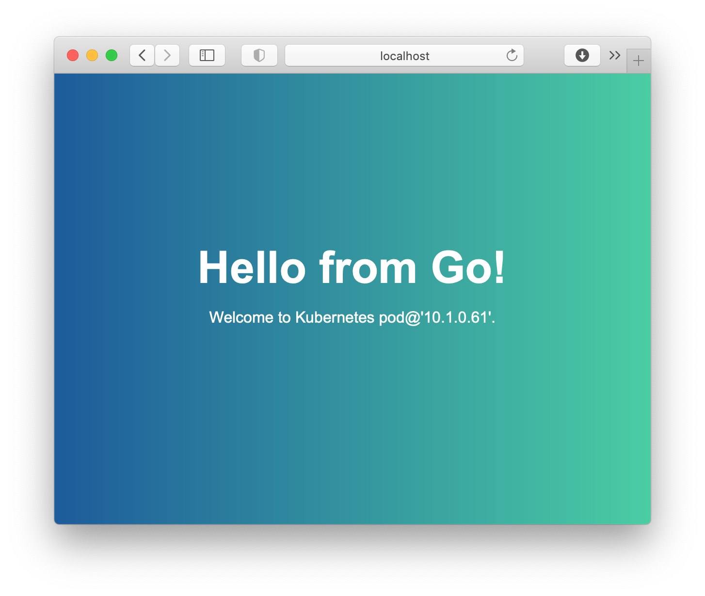

# Go, Gin, JavaScript, Ingress and Kubernetes Tutorial

Microservices and Kubernetes are getting more popular right now. In order to get started with a backend written in Go and a frontend using vanilla JavaScript, we first need install _Docker Desktop for Mac_ and activate Kubernetes in the preferences.

## Create the Go App

Let's create a new directory `api` for our backend and change into it.

```bash
go mod init github.com/somnidev/go-kubernetes
```

Create a new `main.go` file and add the following text.

```go
package main

import (
    "log"
)

func main() {
    log.Println("Hello Go!")
}
```

Once you saved the file return to your shell and run the application.

```bash
% go run main.go 
2021/02/26 18:40:46 Hello Go!
```

## Setting up Gin and your endpoint

We can include Gin just like any other dependency in Go.

```bash
go get -u github.com/gin-gonic/gin
```

This downloads the Gin dependency and adds it to the 'go.mod' file. 

Now we recognize yet another new file in our directory – `go.sum`. That file contains checksums for direct and indirect dependencies of our application and actually some more things not that relevant for our cause.

Now that we have Gin included, let’s set up and start creating the server.

```bash
package main

import "github.com/gin-gonic/gin"

func main() {
    r := gin.Default()
    r.Run()
}
```

Yes, that’s all we need to set up Gin. Using `go build` to build the application and then running the created executable will show us where we can reach Gin (should be curl localhost:8080 on default).

That will give us an HTTP status `404` and some log output indicating that we’re set up and are successfully serving HTTP errors. How to setup [a starting template inside your project](https://gin-gonic.com/docs/quickstart/) and [some sample projcets](https://gin-gonic.com/docs/users/).

```bash
package main

import (
    "github.com/gin-gonic/gin"
)

func main() {
    r := gin.Default()
    r.GET("/message", func(c *gin.Context) {
        c.JSON(200, gin.H{
            "title": "Hello from Go!",
            "message": "Welcome to Kubernetes.",
        })
    })
    r.Run(":8080")
}
```

Run the app.

```bash
go run main.go
```

Now, we can list all package dependencies.

```bash
go list -m all
```

We can also build an executable file.

```bash
go build
```

### Build the Backend Docker Image

We can build a _Single-Stage Docker Image_ using the `golang:alpine` image. Here’s the Dockerfile.

```bash
FROM golang:alpine
WORKDIR /app
ADD . /app
RUN cd /app && go build -o goapp
ENTRYPOINT ./goapp
```

Now we can build the docker image.

```bash
docker build -t somnidev/go-kubernetes-api:latest -t somnidev/go-kubernetes-api:0.1 -f Dockerfile .
```

When we check the size using `docker images` we get about **408** MB, just for our single little Go binary. That's pretty big.

With _Multi-Stage Docker Image_ build, you use multiple FROM statements in your Dockerfile. Each FROM instruction can use a different base, and each of them begins a new stage of the build. You can selectively copy artifacts from one stage to another, leaving behind everything you don’t want in the final image - see [Use multi-stage builds](https://docs.docker.com/develop/develop-images/multistage-build/).

By default, the stages are not named, and you refer to them by their integer number, starting with 0 for the first FROM instruction. However, you can name your stages, by adding an `AS <NAME>` to the FROM instruction.

Now let’s create a _Multi-Stage Docker Image_ using this new Dockerfile.

```bash
# build the app - builder image
FROM golang:1.16.0-alpine3.13 AS builder
RUN mkdir /build
ADD *.go *.mod *.sum /build/
WORKDIR /build
RUN go mod download
RUN CGO_ENABLED=0 GOOS=linux go build -a -o golang-app .

# create clean app image
FROM alpine:3.13
COPY --from=builder /build/golang-app .
ENTRYPOINT [ "./golang-app" ]
```

Now we can build our _Multi-Stage Docker Image_.

```bash
docker build -t somnidev/go-kubernetes-api:latest -t somnidev/go-kubernetes-api:0.1 -f Dockerfile .
```

Let's check the size of the image.

```bash
% docker images | grep somnidev
somnidev/go-kubernetes-api                       latest                                                  f5d04da81e8d   14 minutes ago   15MB
```

Now we get an image that is really small. Only **15MB**. Let's run it.

```bash
docker run --rm -p 8080:8080 somnidev/go-kubernetes-api
```

## Create the Client using JavaScript / ES7

Let's create a new directory `frontend` and an `index.html` file.

```html
<!DOCTYPE html>
<html lang="en">
<head>
    <meta charset="UTF-8">
    <meta http-equiv="X-UA-Compatible" content="IE=edge">
    <meta name="viewport" content="width=<device-width>, initial-scale=1.0">
    <title>Hello Go Kubernetes!</title>
    <link rel="stylesheet" href="styles/styles.css">
</head>
<body>
    <div class="page-content">
        <h1 id='title'>Hello!</h1>
        <p id='body'>Hope you are fine!</p>
    </div>
    <script src="scripts/index.js"></script>
</body>
</html>
```

Additionally we need a stylesheet `styles/styles.css` for our  css styles.

```css
body {
    background: #43cea2;
    background: -webkit-linear-gradient(to right, #185a9d, #43cea2);
    background: linear-gradient(to right, #185a9d, #43cea2);
    color: #fff;
    text-align: center;
    font-family: Arial, Helvetica, sans-serif;
}

.page-content {
    position: absolute;
    text-align: center;
    left: 0;
    right: 0;
    top: 35%;
    bottom: 0;
}

h1 {
    font-size: 46px;
    margin-top: 10px;
    margin-bottom: 10px;
}

h2 {
    font-size: 34px;
    margin-top: 10px;
    margin-bottom: 10px;
}
```

In order to access the backend api we need some javascript in `scripts/index.js`.

```javascript
const getMessage = async () => {
    const response = await fetch(`http://localhost:80/api/message`, {
        method: 'GET',
        mode: 'cors', // cors, no-cors, *cors, same-origin);
    });
    if (response.status === 200) {
        const data = await response.json();
        return data;
    } else {
        throw new Error('Unable to get message')
    }
}
getMessage().then((data) => {
    document.querySelector('#title').innerHTML = data.title;
    document.querySelector('#body').innerHTML = data.body;
}).catch((err) => {
    console.log(`Error: ${err}`);
})
```

### Build the Frontend Docker Image

Now we can create a `Dockerfile` for our Frontend.

```bash
FROM nginx:stable-alpine
RUN rm /usr/share/nginx/html/*.*
COPY index.html /usr/share/nginx/html
COPY . /usr/share/nginx/html/
RUN ls -R /usr/share/nginx/html
EXPOSE 80
CMD ["nginx", "-g", "daemon off;"]
```

Which we can use now to build our Docker Image.

```bash
cd frontend
```

Now build the image.

```bash
docker build -t somnidev/go-kubernetes-frontend:latest -t somnidev/go-kubernetes-frontend:0.1 -f Dockerfile .
```

Now there should be two images.

```bash
% docker image ls
REPOSITORY                           TAG                                                     IMAGE ID       CREATED          SIZE
somnidev/go-kubernetes-frontend      0.1                                                     14e316733531   6 seconds ago    21.9MB
somnidev/go-kubernetes-frontend      latest                                                  14e316733531   6 seconds ago    21.9MB
somnidev/go-kubernetes-api           0.1                                                     f5b0b330461b   39 minutes ago   15MB
somnidev/go-kubernetes-api           latest                                                  f5b0b330461b   39 minutes ago   15MB
```

## Creating a Deployment for Pods

For our deployment we create a file called `pods.yaml`. It creates the Replicasets that brings up the pods.

```yaml
apiVersion: apps/v1
kind: Deployment
metadata:
  name: go-kubernetes-api
  labels:
    app: go-kubernetes-api
spec:
  replicas: 1
  selector:
    matchLabels:
      app: go-kubernetes-api
  template:
    metadata:
      labels:
        app: go-kubernetes-api
    spec:
      containers:
      - name: go-kubernetes-api
        image: somnidev/go-kubernetes-api:0.1
        ports:
        - containerPort: 80
---
apiVersion: apps/v1
kind: Deployment
metadata:
  name: go-kubernetes-frontend
  labels:
    app: go-kubernetes-frontend
spec:
  replicas: 1
  selector:
    matchLabels:
      app: go-kubernetes-frontend
  template:
    metadata:
      labels:
        app: go-kubernetes-frontend
    spec:
      containers:
      - name: go-kubernetes-frontend
        image: somnidev/go-kubernetes-frontend:0.1
        ports:
        - containerPort: 80
```

Before you begin, make sure your Kubernetes cluster is up and running.

Create the Deployment by running the following command.

```bash
kubectl apply -f pods.yaml
```

Since our pod defined in the _template_ has the _label_ `app: go-kubernetes` we can list `-l` only pods with that label.

```bash
kubectl get pods -l app=go-kubernetes -o wide
```

To access a pod and take a look inside, we can get a shell into the running container.

```bash
kubectl exec --stdin --tty POD_NAME_HERE -- /bin/bash
```

Now we can delete the deployment with the following command.

```bash
kubectl delete -f pods.yaml
```

## Create the Services

Since you can't connect to Pods there is a concept called a _Kubernetes Service_. A _Kubernetes Service_ is an abstraction which defines a logical set of Pods running, whereby each Pod provides the same functionality.

When created, each Service is assigned its own unique IP address, also called _clusterIP_. This address is tied to the lifespan of the Service, and will not change while the Service is alive.

Pods can be configured to talk to the Service, and know that communication to the Service will be automatically load-balanced out to some pod that is a member of the Service.

We create a new file `services.yaml` for our service definitions to check if our backend service works as expected.

```yaml
apiVersion: v1
kind: Service
metadata:
  name: go-kubernetes-api
spec:
  ports:
  - name: http
    port: 80
    targetPort: 80
    nodePort: 30080
  selector:
    app: go-kubernetes-api
  type: NodePort
```

To access a service we need a _type: NodePort_ to expose our Service to the outside of the cluster. Notice that the NodePort has to be greater than `30080`. Notice we can remove the `NodePort` after we have tested the configuration and replace it with `type: ClusterIP`. In order to access the service we use `http://localhost:30080/message`.

Now we can replace our `services.yaml` with the following code.

```yaml
apiVersion: v1
kind: Service
metadata:
  name: go-kubernetes-api
spec:
  ports:
  - name: http
    port: 80
    targetPort: 80
  selector:
    app: go-kubernetes-api
  type: ClusterIP
---
apiVersion: v1
kind: Service
metadata:
  name: go-kubernetes-frontend
spec:
  ports:
  - name: http
    port: 80
    targetPort: 80
  selector:
    app: go-kubernetes-frontend
  type: ClusterIP
```

In Order to access our services we need an Ingress.

## Creating an Ingress for the K8s cluster

Assuming you have Docker for Mac installed, follow the next steps to set up the _Nginx Ingress Controller_ on your local Kubernetes cluster - and take a look at the [Installation Guide](https://kubernetes.github.io/ingress-nginx/deploy/#docker-for-mac) for the actual link.

Run the following command to set up the NGINX Ingress.

```bash
kubectl apply -f https://raw.githubusercontent.com/kubernetes/ingress-nginx/controller-v1.6.4/deploy/static/provider/cloud/deploy.yaml
```

Verify the service was enabled by running the following:

```bash
kubectl get pods -n ingress-nginx
```

Or use the label.

```bash
kubectl get pods --all-namespaces -l app=ingress-nginx
```

Since `apiVersion: networking.k8s.io/v1beta1`is deprecated we use `apiVersion: networking.k8s.io/v1`. Take a look at Kubernetes Documentation for more information on [Ingress](https://kubernetes.io/docs/concepts/services-networking/ingress/). Now, let's create the _ingress configuration_ `ingress.yaml`.

```yaml
apiVersion: networking.k8s.io/v1
kind: Ingress
metadata:
  name: nginx-ingress
  annotations:
    kubernetes.io/ingress.class: nginx
    nginx.ingress.kubernetes.io/use-regex: 'true'
    nginx.ingress.kubernetes.io/rewrite-target: /$1
spec:
  rules:
  - http:
      paths:
      - path: /api/?(.*)
        pathType: Prefix
        backend:
          service:
            name: go-kubernetes-api
            port:
              number: 80
      - path: /?(.*)
        pathType: Prefix
        backend:
          service:
            name: go-kubernetes-frontend
            port:
              number: 80              
```

In order to verify that the configuration is correct, open your browser and go to `http://localhost:80/api/message` to check the endpoint is working fine and then we open `http://localhost:80`.

## Scaling up to more pods

Before we scale up to more than one pod we add some more stuff to our pod and show the pods actual ip address.

```go
package main

import (
  "log"
  "net"
  "net/http"

  "github.com/gin-gonic/gin"
)

func getIpAddress() string {
  conn, err := net.Dial("udp", "8.8.8.8:80")
  if err != nil {
    log.Fatal(err)
  }
  defer conn.Close()
  ipAddress := conn.LocalAddr().(*net.UDPAddr)
  return ipAddress.IP.String()
}

func getMessage(context *gin.Context) {
  context.JSON(http.StatusOK, gin.H{
    "title": "Hello from Go!",
    "body":  "Welcome to Kubernetes pod@'" + getIpAddress() + "'.",
  })
}

func main() {
  router := gin.Default()
  router.GET("/message", getMessage)
  router.Run(":80")
}
```

In order to scale up to three backend pods we have to change our deployment.

```yaml
apiVersion: apps/v1
kind: Deployment
metadata:
  name: go-kubernetes-api
  labels:
    app: go-kubernetes-api
spec:
  replicas: 3
  selector:
    matchLabels:
      app: go-kubernetes-api
  template:
    metadata:
      labels:
        app: go-kubernetes-api
    spec:
      containers:
      - name: go-kubernetes-api
        image: somnidev/go-kubernetes-api:0.1
        ports:
        - containerPort: 80
---
apiVersion: apps/v1
kind: Deployment
metadata:
  name: go-kubernetes-frontend
  labels:
    app: go-kubernetes-frontend
spec:
  replicas: 1
  selector:
    matchLabels:
      app: go-kubernetes-frontend
  template:
    metadata:
      labels:
        app: go-kubernetes-frontend
    spec:
      containers:
      - name: go-kubernetes-frontend
        image: somnidev/go-kubernetes-frontend:0.1
        ports:
        - containerPort: 80
```

Just apply that configuration.

```bash
kubectl apply -f pods.yaml
```

We can get the ip address for our pods.

```bash
% kubectl get po -o wide
NAME                                      READY   STATUS    RESTARTS   AGE     IP          NODE             NOMINATED NODE   READINESS GATES
go-kubernetes-api-5d9f9b85d6-6z84k        1/1     Running   0          2m12s   10.1.0.60   docker-desktop   <none>           <none>
go-kubernetes-api-5d9f9b85d6-lsdf8        1/1     Running   0          2m12s   10.1.0.61   docker-desktop   <none>           <none>
go-kubernetes-api-5d9f9b85d6-w5fz8        1/1     Running   0          12m     10.1.0.58   docker-desktop   <none>           <none>
go-kubernetes-frontend-6cf7d6ff68-7j7rq   1/1     Running   0          12m     10.1.0.59   docker-desktop   <none>           <none>
```

Refreshing the browser shows the ip address.



## Securing the Ingress

In order to secure our Ingress Service we have to follow the steps shown in the Kubernetes Documentation [Connecting Applications with Services - Securing the Service](https://kubernetes.io/docs/concepts/services-networking/connect-applications-service/#securing-the-service).

## How to upgrade all dependencies at once

In order to upgrade all dependencies at once, run the following command from the root directory of your module.

This upgrades to the latest or minor patch release

```bash
go get -u ./...
```

For more information see [How To Upgrade Golang Dependencies](https://golang.cafe/blog/how-to-upgrade-golang-dependencies.html).

## Quick start

Change to the api directory.

```bash
cd api
```

Build the Backend Docker Image.

```bash
docker build -t somnidev/go-kubernetes-api:latest -t somnidev/go-kubernetes-api:0.1 -f Dockerfile .
```

Change directory to frontend.

```bash
cd ../frontend
```

Build the Frontend Docker Image.

```bash
docker build -t somnidev/go-kubernetes-frontend:latest -t somnidev/go-kubernetes-frontend:0.1 -f Dockerfile .
```

Now we change to the kubernetes directory.

```bash
cd ../kubernetes
```

Install NGINX if you didn`t do that until now.

```bash
kubectl apply -f ingress-deploy.yaml
```

Check which namespaces are available.

```bash
kubectl get ns
```

Check if everything has started.

```bash
kubectl get all -n ingress-nginx
```

Wait some seconds until the ingress is up and running. Then we can configure it, start the pods and the serv.

```bash
kubectl apply -f ingress.yaml
kubectl apply -f pods.yaml services.yaml
```

Open the browser and go to [http://localhost](http://localhost). If you refresh the page, you will see a different IP from another node.

## Thanks to

- [Favicon Generator](https://favicon.io) used for the `favicon.png`
- [Uxío García Andrade - Deploy a Full-Stack Go and React App on Kubernetes](https://betterprogramming.pub/deploy-a-full-stack-go-and-react-app-on-kubernetes-4f31cdd9a48b)
- [Golang, Gin & MongoDB – Building microservices easily](https://blog.codecentric.de/en/2020/04/golang-gin-mongodb-building-microservices-easily/)
